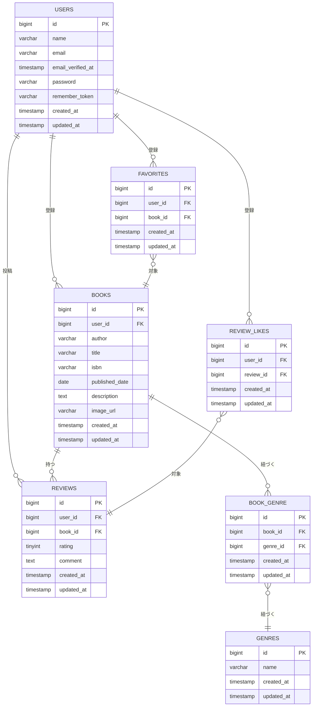

# BookShelf 書籍レビューアプリ

## 概要

書籍レビュー機能を備えた書籍管理アプリです。

## 実装機能

- ユーザー登録・ログイン・ログアウト機能
- 書籍の登録・確認・編集・削除機能
- 書籍一覧画面で書籍情報の一覧表示
- 書籍詳細画面での書籍情報・レビュー一覧表示
- ジャンルの登録・編集・削除機能
- ジャンル一覧画面でジャンル情報の一覧表示
- お気に入りの登録・解除機能
- レビューの登録・編集・削除機能
- レビューに対するいいねの登録・解除機能
- ランキング機能
- 公開API機能

## ER図



## 環境構築手順

### 1. リポジトリをclone

GitHubからリポジトリをcloneします。

```bash
git clone https://github.com/Yutaka-1101/bookshelf-app

cd bookshelf-app
```

### 2. 環境ファイルの作成

`.env.example`をコピーして`.env`を作成します。

```bash
cp .env.example .env
```

### 3. Dockerコンテナの起動

Laravel Sailを起動します。

```bash
sail up -d
```

### 4. Composerパッケージのインストール

必要なPHPパッケージをインストールします。

```bash
sail composer install
```

### 5. アプリケーションキーを生成します。

```bash
sail artisan key:generate
```

### 6. 環境変数の設定

`.env`ファイルのデータベース接続環境を以下の内容に設定します。

```env
DB_CONNECTION=mysql
DB_HOST=mysql
DB_PORT=3306
DB_DATABASE=laravel
DB_USERNAME=sail
DB_PASSWORD=password
```

※`DB_HOST` は `localhost` や `127.0.0.1` ではなく、Dockerコンテナ名の 'mysql' を指定してください。

### 7. データベースの作成

マイグレーションとシーディングを実行します。

```bash
sail artisan migrate --seed
```

既存のデータベースをリセットする場合は、以下を実行してください。

```bash
sail artisan migrate:fresh --seed
```

### 8. フロントエンドのセットアップ

Node.jsの依存パッケージをインストールします。

```bash
sail npm install
```

Viteサーバーを起動します。

```bash
sail npm run dev
```

※`sail npm run dev`を実行した状態で開発を行ってください。

### 9. アプリケーションの確認

以下URLにアクセスしてください。

http://localhost

## テスト実行

PHPUnitテストを実行する場合は、以下のコマンドを使用してください。

```bash
sail artisan test
```

## 使用技術

- PHP 8.5
- Laravel 10.x
- MySQL 8.4
- Nginx
- Docker
- Laravel Sail
- phpMyAdmin
- Vite
- Tailwind CSS
- Alpine.js
- PHPUnit
- Laravel Sanctum

## APIエンドポイント一覧

### 書籍一覧

- **GET** `/api/v1/books`:書籍一覧を取得

### 書籍詳細

- **GET** `/api/v1/books/{book}`:指定した書籍の詳細を取得

### 書籍登録

- **POST** `/api/v1/books`:書籍を登録

### 書籍更新

- **PUT** `/api/v1/books/{book}`:指定した書籍を更新

### 書籍削除

- **DELETE** `/api/v1/books/{book}`:指定した書籍を削除

## 開発環境URL

http://localhost

## 作成者

髙橋 豊
